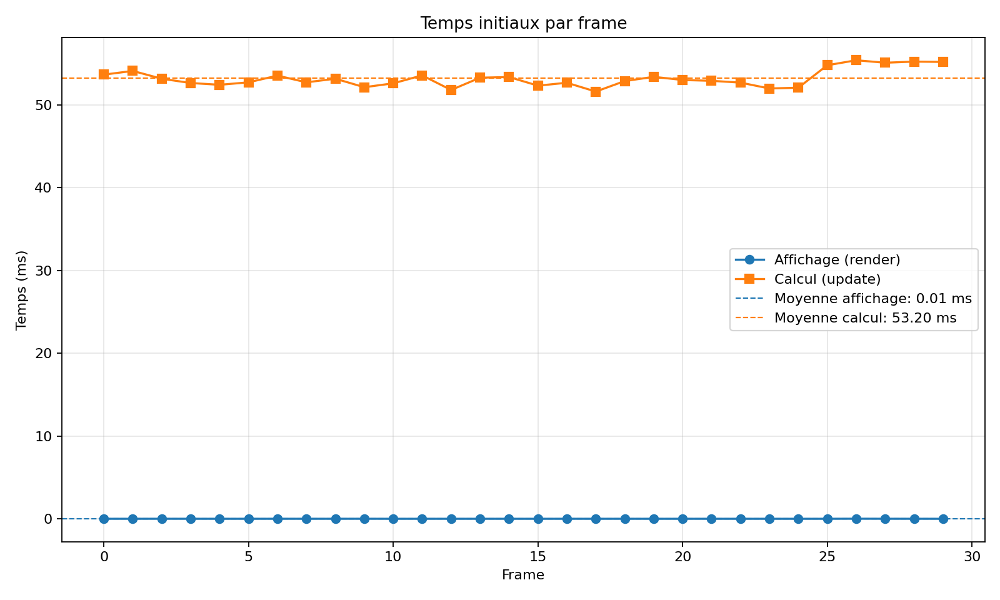
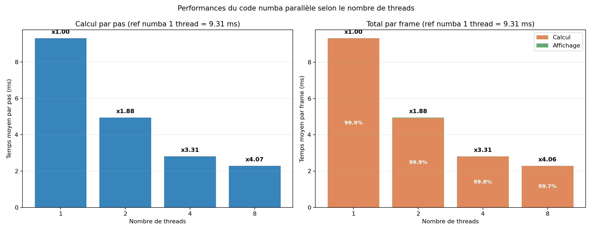
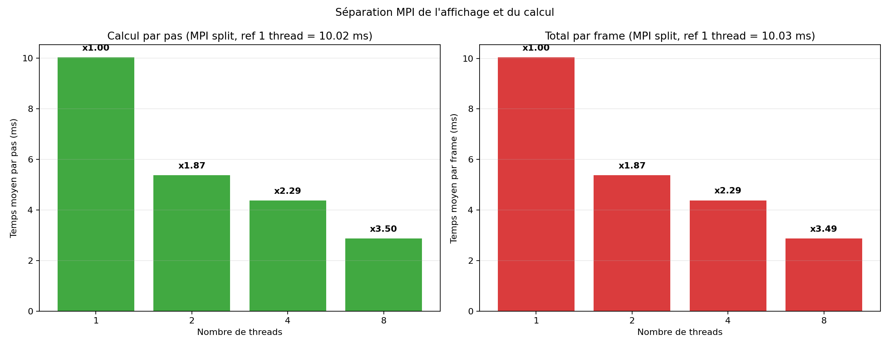
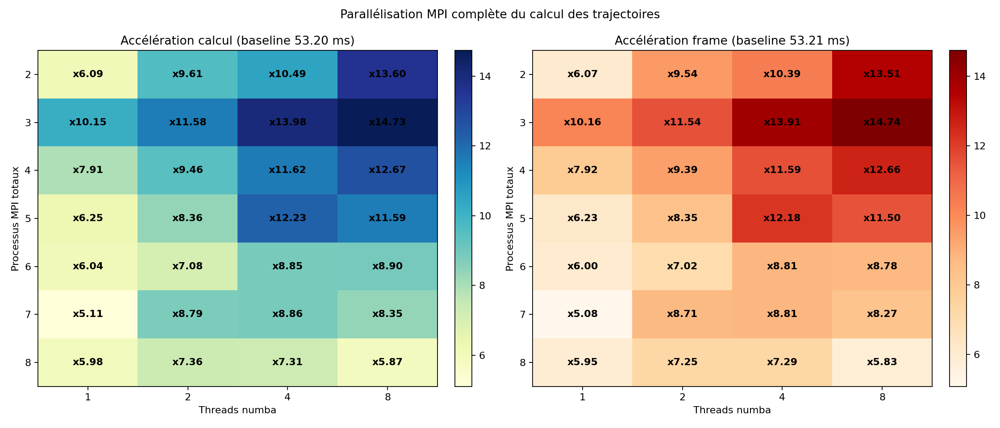

# Rapport pour Parallélisation d'un code de simulation de galaxie

Nan LIN, 17 Mars, 2026

Les résultats sont disponibles dans le dossier `outputs/`, y compris des fichiers `.csv` et des graphiques.

## Description du programme séquentiel

**Question préliminaire** : En observant la forme des galaxies, pourquoi il n'est pas intéressant de prendre une valeur pour $N_{k}$ autre que 1 (sachant que $N_{k}$ donne le nombre de cellules en $Oz$) ?

La galaxie simulée présente une structure de disque mince, dont l’épaisseur selon l’axe $Oz$ est très faible par rapport aux dimensions selon $Ox$ et $Oy$. Ainsi, prendre $N_k > 1$ reviendrait à subdiviser une direction où la densité de matière varie peu, ce qui conduit à de nombreuses cellules vides ou très peu peuplées.

Dans le code, cette subdivision supplémentaire augmente le coût de gestion de la grille sans apporter d’amélioration significative.

Il est donc plus pertinent de concentrer la discrétisation sur le plan $Oxy$ et de choisir $N_k = 1$.

## Mesure du temps initial

**Question**. Observez les temps pris pour l'affichage et le calcul. Quel est la partie de l'algorithme (le calcul des trajectoires ou l'affichage) qui est la plus intéressante à paralléliser ?

```sh
cd examen
make initial-times

# which is equivalent to ...

uv run python measure_initial_times.py \
  --mode headless \
  --data data/galaxy_1000 \
  --dt 0.001 \
  --grid 20 20 1 \
  --warmup-steps 3 \
  --frames 30 \
  --csv outputs/initial_times.csv

uv run python plot_initial_times.py \
  --csv outputs/initial_times.csv \
  --output outputs/initial_times.png
```

Le résultat: 

Dans cette mesure `headless`, la préparation des données d'affichage est négligeable devant le calcul des trajectoires. Le calcul reste donc la partie la plus intéressante à paralléliser.

## Parallélisation en numba du code séquentiel

**Question**. Calculer l'accélération du code en fonction du nombre de threads.

```sh
cd examen
make numba-parallel 

# which is equivalent to ...

uv run python benchmark_numba_parallel.py \
    --data data/galaxy_1000 \
    --dt 0.001 \
    --grid 20 20 1 \
    --warmup-steps 3 \
    --steps 10 \
    --threads 1 2 4 8 \
    --csv outputs/numba_parallel_benchmark.csv
```

On obtient :



L’accélération est calculée par la formule `S(p) = T1 / Tp`, où `T1` est le temps de la version numba à 1 thread et `Tp` le temps à `p` threads. Avec les résultats obtenus dans ce dépôt, on passe d’environ `9.865 ms` à 1 thread à `2.448 ms` à 8 threads, soit une accélération d’environ `x4.03`. La montée en charge est donc bonne, sans être parfaitement linéaire à cause des surcoûts de parallélisation et de la part séquentielle restante.

## Séparation de l'affichage et du calcul

**Question**. Comparez l'accélération obtenue en fonction du nombre de threads utilisés pour le calcul avec la version précédente. Que constatez-vous ? Pourquoi ?

```sh
cd examen
make mpi-split

# which is equivalent to ...
mpirun -n 2 /bin/zsh -lc 'uv run python benchmark_mpi_split.py --data data/galaxy_1000 --dt 0.001 --grid 20 20 1 --warmup-steps 3 --steps 10 --threads 1 2 4 8 --csv outputs/mpi_split_benchmark.csv'
```

On obtient : 

On constate que l'accélération augmente quand le nombre de threads de calcul augmente, mais elle reste du même ordre que dans la version précédente. Cela s'explique par le fait que le coût dominant reste le calcul numérique lui-même. La séparation MPI entre affichage et calcul n'accélère pas fortement l'algorithme ; elle ajoute même un léger surcoût de communication et de synchronisation. Le gain principal provient donc toujours du parallélisme numba.

## Parallélisation du calcul

**Travail à effectuer** :

  - Mettre en œuvre la parallélisation des trajectoires avec MPI à l'aide du code obtenue dans la partie précédente;
  - Calculer l'accélération obtenue en fonction du nombre de processus **ET** de threads numba;
  - En observant que la densité d'étoiles diminue avec l'éloignement du trou noir, quel problème de performance de notre algorithme parallèle peut handicaper l'accélération ?
  - Proposer une distribution "intelligente" des cellules de notre grille cartésienne. Quel problème de performance peut alors apparaître ? (on ne demande pas de mettre en œuvre cette distribution). 

Code :

```sh
cd examen
make mpi-full

# which is equivalent to ...
uv run python benchmark_mpi_full.py \
  --data data/galaxy_1000 \
  --dt 0.001 \
  --grid 20 20 1 \
  --warmup-steps 3 \
  --steps 10 \
  --processes 2 3 4 5 6 7 8 \
  --threads 1 2 4 8 \
  --csv outputs/mpi_full_benchmark.csv

# which will call like ...
mpirun -n 3 /bin/zsh -lc 'uv run python nbodies_mpi_full.py --data data/galaxy_1000 --dt 0.001 --grid 20 20 1 --threads 4 --warmup-steps 3 --steps 10 --json'

```

On obtient : 

On constate donc que :
- l’augmentation du nombre de threads numba améliore globalement les performances pour un nombre de processus MPI fixé ;
- passer de 2 à 3 processus MPI améliore nettement le temps de calcul ;
- en revanche, au-delà de 3 processus MPI, les performances ne progressent plus de façon régulière et se dégradent souvent, ce qui montre que le surcoût de communication, de synchronisation et le déséquilibre de charge finissent par dominer.

Après correction de l’implémentation MPI complète, le meilleur cas mesuré dans le fichier `outputs/mpi_full_benchmark.csv` est obtenu avec `3` processus MPI au total (`2` rangs de calcul) et `8` threads numba, avec un temps de calcul moyen de `3.611 ms`.


On en déduit que l’accélération n’est pas monotone avec le nombre de processus MPI : au-delà d’un certain point, les surcoûts liés à la distribution du travail, aux communications et à la synchronisation deviennent trop importants.

Le problème principal est un déséquilibre de charge. Dans l’implémentation actuelle, la grille est découpée uniformément suivant `Ox`, c’est-à-dire que chaque processus reçoit à peu près le même nombre de cellules. Or, dans une galaxie, les étoiles sont beaucoup plus concentrées près du centre que dans les zones extérieures. Par conséquent, certaines tranches de grille contiennent beaucoup plus de corps et donc beaucoup plus d’interactions à calculer que d’autres.

Une distribution plus intelligente consisterait à ne plus répartir les cellules uniformément, mais à les distribuer en fonction de leur charge estimée. Par exemple, on peut attribuer moins de cellules centrales à chaque processus, car elles contiennent beaucoup d’étoiles, et davantage de cellules périphériques, car elles sont peu peuplées. L’objectif est que chaque processus reçoive une quantité de travail similaire plutôt qu’un même nombre de cellules.

Cette stratégie permettrait d’améliorer l’équilibrage de charge et donc potentiellement les performances globales.

Cependant, un nouveau problème peut apparaître : l’augmentation du coût des communications. Si la distribution devient irrégulière, les frontières entre sous-domaines deviennent plus complexes, la gestion des cellules fantômes devient plus coûteuse, et les échanges de particules entre processus peuvent devenir plus fréquents. Autrement dit, on réduit le déséquilibre de charge, mais on risque de faire apparaître un autre goulot d’étranglement : le coût de communication et de synchronisation entre processus.
